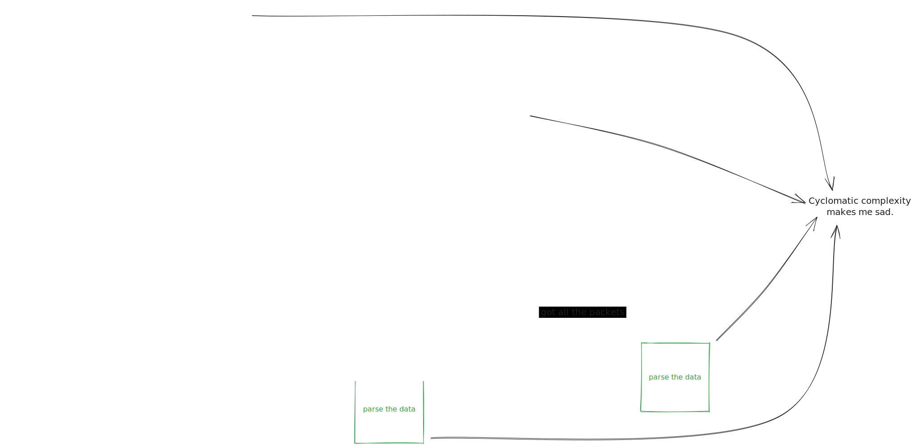

# Using `A2S` Directly

If `A2S.Client`'s process architecture isn't suitable for your needs, you can use the parsing functions in `A2S` directly. In order to do so, you'll need to understand the steps necessary to perform A2S queries.

## A rough visual guide
Each colored box is some internal action taken by your app. Each arrow represents a game server reply.

### In a perfect world this would be the flow:
*Where the 'challenge step' is necessary to mitigate A2S queries from being used in reflection attacks.*

### How it actually works:
*Given the A2S protocol's used by a tons of games in various states of implementation.* ([fullscreen](assets/how-it-actually-works.svg))

[`A2S.Statem`](https://github.com/Moosieus/elixir-a2s/blob/main/lib/a2s/statem.ex) may be of good reference for how to handle this in your own app.

## Other notes
- `A2S.Client` is specifically optimized for querying numerous game servers on a frequent basis.
- Official Valve servers may not respond to A2S queries.
- Some game servers ignore certain fields, filling them with zero values.
- [A2S_INFO](https://steamcommunity.com/discussions/forum/14/2974028351344359625/) was updated relatively recently to the rest of the protocol to mitigate reflection attacks.
- See Valve's [official A2S documentation](https://developer.valvesoftware.com/wiki/Server_queries) for more details on A2S.
